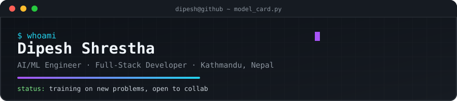

<div align="center">
  
</div>

<div align="center">

`AI/ML Engineer` · `Full-Stack Developer` · `v2.6.0` · `📍 Kathmandu, NP`

</div>

<br/>

<table align="center">
<tr><td>

```yaml
model_card:
  name: Dipesh Shrestha
  type: general-purpose software & ML engineer
  version: "2.6.0"
  license: open-to-collaborate
  languages: [Python, PHP, Java, JavaScript]
```

</td></tr>
</table>

<br/>

## 📋 Model Description

A full-stack engineer fine-tuned on web development, currently undergoing
continued pre-training on deep learning, computer vision, and NLP. Best
results observed when paired with an interesting problem and a strong
cup of coffee ☕.

<br/>

## 🎯 Intended Use

| Use case | Fit |
|---|---|
| Building ML-powered applications end-to-end | ✅ Primary |
| Full-stack web apps (Flask / Django / Laravel) | ✅ Primary |
| Computer vision & NLP prototypes | ✅ Primary |
| MLOps & cloud deployment | 🟡 Actively improving |
| Sitting still | ❌ Out of scope |

**Currently fine-tuning on:** `Snipper` — a URL shortener API, plus a deeper pass on MLOps, LLMs, and RAG pipelines.

<br/>

## 🧠 Architecture

<table>
<tr>
<td width="50%" valign="top">

**Core layers**
```
Languages   → Python · PHP · Java · JS
Frameworks  → Flask · Django · Laravel
AI/ML       → TensorFlow · OpenCV · scikit-learn
Cloud       → AWS
Tooling     → Docker · Git · Postman · Linux
```

</td>
<td width="50%" valign="top">

**Weight distribution**
<br/>


</td>
</tr>
</table>

<br/>

## 📊 Evaluation Results

Benchmarked against real-world problems:

| Benchmark | Task | Result |
|---|---|---|
| [`Facial-Expression-Music-Recommendation`](https://github.com/dipeshshrestha16/Facial-Expression-based-Music-Recommendation) | CV → emotion detection → music recs | 🎵 Ships music that matches your face |
| [`Pneumonia-Detection`](https://github.com/dipeshshrestha16/Pneumonia-Detection) | Medical imaging classification | 🩺 Flags pneumonia from chest X-rays |
| [`URL-Shortener-API`](https://github.com/dipeshshrestha16/URL-Shortener-API) | REST API design | 🔗 Snipper — clean, fast link shortening |
| [`ML-and-AI`](https://github.com/dipeshshrestha16/ML-and-AI) | ML fundamentals sandbox | 🧪 Experiments & notebooks |
| [`Kaffe-Management-System`](https://github.com/dipeshshrestha16/Kaffe-Management-System) | Full-stack CRUD app | ☕ Inventory & orders, fully brewed |

<br/>

## 📈 Training Metrics

<div align="center">
  
  
</div>

<br/>

## ⚠️ Limitations & Known Issues

- May occasionally get distracted by a shiny new framework mid-project
- MLOps pipeline still in early training epochs
- Documentation quality varies by caffeine level

<br/>

## 🔌 How to Reach This Model

<div align="center">

<a href="https://www.linkedin.com/in/dipesh-shrestha-526873259/"></a>
<a href="mailto:dipeshresthaaa@gmail.com"></a>
<a href="https://www.instagram.com/dipeshshrestha_16/"></a>

</div>

<br/>

<div align="center">

```
>>> collaborate(you, dipesh)
Response: "let's build something intelligent 🚀"
```

<sub>Model last updated: 2026 · Inference available on request</sub>

</div>
