<div align="center">
  
</div>

<br/>

<div align="center">

`AI/ML Engineer`&nbsp;·&nbsp;`Full-Stack Developer`&nbsp;·&nbsp;`Kathmandu, NP`

</div>

<br/>

## Description

A full-stack engineer working mostly in Python, with a growing focus on
applied machine learning — computer vision and NLP systems that go from
raw input to a decision, not just a demo.

<br/>

## Log

```
$ current   Snipper — a URL shortener API (Flask, Redis)
$ studying  MLOps pipelines, LLM & RAG architectures
$ exploring computer vision, NLP systems
```

<br/>

## Skill Matrix

<div align="center">
  
</div>

<br/>

## Shipped

| Project | What it does | Stack |
|---|---|---|
| [`Facial-Expression-Music-Recommendation`](https://github.com/dipeshshrestha16/Facial-Expression-based-Music-Recommendation) | Reads facial expression from a webcam feed and recommends music matched to the detected mood | `Python` `OpenCV` `TensorFlow` |
| [`Pneumonia-Detection`](https://github.com/dipeshshrestha16/Pneumonia-Detection) | Classifies chest X-rays for signs of pneumonia | `Python` `TensorFlow` `CNN` |
| [`URL-Shortener-API`](https://github.com/dipeshshrestha16/URL-Shortener-API) | REST API for link shortening — Snipper | `Flask` `Redis` |
| [`Kaffe-Management-System`](https://github.com/dipeshshrestha16/Kaffe-Management-System) | Full-stack inventory and order management | `PHP` `Laravel` `MySQL` |
| [`ML-and-AI`](https://github.com/dipeshshrestha16/ML-and-AI) | Sandbox of ML experiments and notebooks | `Python` `scikit-learn` |

<br/>

## Activity

<div align="center">
  
  
</div>

<br/>

## Contact

<div align="center">

<a href="https://www.linkedin.com/in/dipesh-shrestha-526873259/"></a>
<a href="mailto:dipeshresthaaa@gmail.com"></a>
<a href="https://github.com/dipeshshrestha16"></a>

</div>

<br/>

<div align="center">
<sub>readme.rev · 2026.07</sub>
</div>